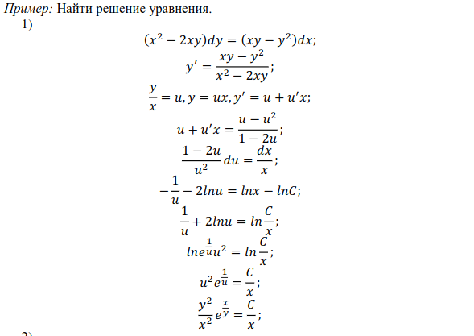
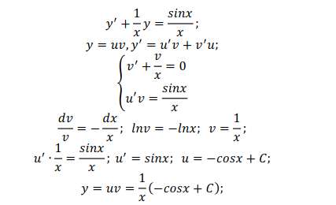
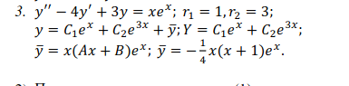
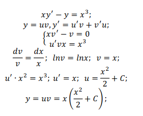
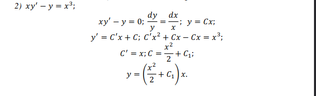

<!-- title: Вопросы матан -->

- 19. $xy'-y=x^3$ [Решение](#19)
- 10. $\int\limits_{-\frac{\pi}{2}}^{\frac{\pi}{2}}\frac{dx}{1+cosx}$ **№2251, стр 146**
- 11. $y''-4y'+3y=xe^x$ [Решение](#11) **Есть в лекции**
- 18. $\int\limits_0^1 xe^{-x}dx$ **№2259, стр 146**

---

1. $(x^2 - 2xy)dy=(xy-y^2)dx$ [Решение](#1) **Есть в лекции**
2. $\int\limits_{-\frac{1}{7}}^{1}\frac{xdx}{\sqrt{8+2x-x^2}}$ [Решение](#2) **Решил, но не нашел**
3. $y' +4y = 2cos2x$
4. $\sum\limits_{n=1}^\infin(\frac{4n+1}{3n^2+5})^n$
5. $\int\limits_0^{e-1}ln(x+1)dx$ **№2264, стр 146**
6. $y'+\frac{1}{x}y=\frac{sinx}{x}$ [Решение](#6) **Есть в лекции**

# 1

Дифференциальное уравнение первого порядка называется однородным
если оно может быть представлено в виде 𝑦′ = 𝑓(𝑥, 𝑦). См. Лекции стр. 86

# 2

$
\int\limits_{-\frac{1}{7}}^{1}\frac{xdx}{\sqrt{8+2x-x^2}} =
\int\limits_{-\frac{1}{7}}^{1}\frac{(x-1+1)dx}{\sqrt{9-(x-1)^2}} =
\int\limits_{-\frac{1}{7}}^{1}\frac{(x-1)dx}{\sqrt{9-(x-1)^2}}+
\int\limits_{-\frac{1}{7}}^{1}\frac{dx}{\sqrt{9-(x-1)^2}} =
arcsin(\frac{x-1}{3}) - \sqrt{9-(x-1)^2} \Bigg|_{-\frac{1}{7}}^1
$

# 6

См. Лекции стр. 89

# 11

См. Лекции стр. 107

# 19

## Вариант 1

См. Лекции стр. 89

## Вариант 2 (Метод вариации произвольной постоянной)

См. Лекции стр. 100
